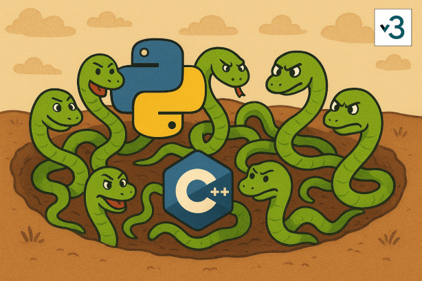

## SnakePit



Self-hosted, open-source, high performance chat server.

Work in progress.

- IRCv3 based
  - backward compatible with old IRC clients
- account based (SASL login)
  - allow multiple clients per account
  - always-on functionality
- scrollbacks/history
- realm based ('create servers')
- allow anonymous logins
- CPython integration for server-side scripting
- web invites
- admin web-interface, API
- SQL backend (sqlite)
- Embedded [Meilisearch](https://github.com/meilisearch/meilisearch/) for full-text searches
- audio/video calls
- Easy to install
- Easy to configure
- Runs on a potato

## Server-side scripting

Change messages on-the-fly, modify/add IRCv3 message tags in transit, and more.

```python3
@qirc.on(QIRCEvent.CHANNEL_MSG)
def channel_message_handler(self, channel: Channel, acc: Account, msg: Message) -> Message:
  if acc.username == "sander":
    # messages from `sander` are always uppercase now
    msg.text = msg.text.upper()

  # all channel messages get this tag attached
  msg.tags["example-tag"] = "example-value"
  return msg
```

`Channel` and `Account` objects are available for any additional logic.

More info [docs/modules.md](docs/modules.md)

## Requirements

- Platform(s) supported: Linux x86/64
- Dependencies: Qt6, Python >= 3.13
- Build dependencies: CMake, C++17

## Testimonials

> &lt;user1&gt; What problem does this solve? 

> &lt;user2&gt; Lua would be a better choice for a scripting engine than Python

> &lt;user3&gt; you can finish the IRC server in Hell with all the other C++ programmers  
> &lt;user3&gt; and Python programmers  
> &lt;user3&gt; us Perl/Go programmers are going to heaven

> &lt;user4&gt; What is your elevator pitch?
 
> &lt;user5&gt; Qt is bloated  
> &lt;user5&gt; what if I want to run this on ARM?